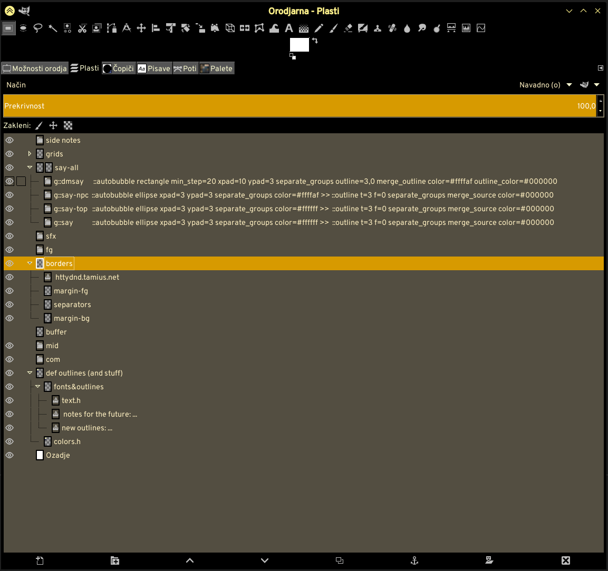

# NOTE: this script is being developed right now and is not in a working state.

# Automatic speech bubble script for GIMP

This script draws speech bubbles around text layers. Because this script was developed specifically for my specific needs, here's features and limitations. 

## Features

* This script will draw a "speech bubble" around a layer of text.
* If this script is ran while layer group is selected, it will draw speech bubbles around all layers in the layer group. 
* The script will draw either kinda-rectangle or ellipse and fill it with a color of your choosing
* You can pass bubble parameters via layer/layer group name.
* Option to remove previous bubble layers when running a script again (TODO)

## Limitations

* It's currently **NOT** in a working state. DO NOT USE, it'll do nothing at all.
* It will only draw the bubble.
* It will **NOT** draw the tails
* It will **NOT** draw the outline 
* Every text layer is treated as a single bubble. Don't put multiple bubbles' worth of text on a single layer.

### Auto-bubbling based on layer name

**Warning: for advanced users only.**

This feature is mildly useful if you're doing repetitive things, such as e.g. making a regular comic or something (especially if you're using multiple different outlines on different comic elements). If you're using a template file for your comic (with all layer groups pre-defined), you can put a "command block" into the layer name. When running extension in automatic mode, extension will create bubbles according to what's in the command block.

You can only use ***one*** command block for a single script. However, it should be safe to mix command blocks of multiple scripts.

~~If script runs recursively inside a layer group, any nested layer group will be processed with the same parameters as the parent group unless specified otherwise. (Some commands are exception to the rule)~~ Not true 

If ~~selected/top level~~ _a_ layer group doesn't have a command block, it will be skipped. Any descendant layer or layer group that has a command block in its name, however, will be processed according to command parameters.

When creating bubbles, new layer should appear under the group.

Example of a command block is here.

**Available commands**

`()=>autobubble` — start of command block for auto-bubble script. Everything after this should be an argument. Arguments are separated by space.
`skip` — don't process this layer / layer group. It doesn't stop recursion — the children will be processed normally. Doesn't apply to children.
`()=>skip` — same as `skip`, except it also tells other scripts (that I wrote and have similar auto capabilites) to ignore this block. Doesn't apply to children.
`end` — don't process this layer / layer group. Don't process children, either. Do I need to state the obvious?
`()=>end` — makes other scripts of mine respect `end` command as well.
`ellipse` — bubble will be an ellipse
`rectangle` — bubble will be  a rectangle
`ypad=X` — bubble should have this many pixels of empty space above and below the upper and lower edges of text.
`xpad=X` — bubble should have this many pixels of empty space to the left and right of the left and right edges of text.
`color=#xxxxxx` — speech bubble color in hexadecimal/html values. Only takes the six-digit hex code, not words.
`outline=X[,Y]` — automatically add outline to speech bubbles. X is thickness of outline in pixels. Y is optional parameter for feather.
`outline_color=#xxxxxx` — color for outline. Meaningless if `outline` option is not specified.
`no_auto` — toggles automatic mode off. Not sure if useful.
`separate_groups` — will create bubbles for entire group instead instead of outlining each layer inside of the group individually. Outline of a layer group will not include outline of layers inside nested groups. Those will be processed separately.
`separate_layers` — will create a bubble for every layer inside a group (recursively)

If neither `separate_groups` and `separate_layers` are set, ~~script will outline current layer or layer group. If creating bubble on layer group in this case, the bubble layer will contain bubbles of all layers in the layer group, including layers inside a nested group~~TODO. These two options can _not_ be defined at the same time. If you try to use both at once, the last one wins.~~

`merge_source` — merge source layer. Only works with `separate_layers` option.
`merge_outline` — merge outline with bubble layer. Only works if `outline` option is toggled.

Sometimes when using multiple levels of nested groups, you may want to use different rules for parents and children. All of these four are default values, meaning you normally don't need to specify them.

`no_merge_source` — don't merge source.
`no_merge_outline` — don't merge outline.
`no_separate_groups` — opposite of `separate_layers`.
`no_separate_layers` — opposite of `separate_layers`.

**Before we go into the rest of commands, here's an important technical stuff about how the outline layer is named**

When creating a layer, the script will name the outline layer as `::autobubble ` + original name (minus ***any*** command block) + ` ()=>skip`. E.g. say you want to make an outline of a layer named `Testy McTestyface ()=>autobubble t=1 color=#000000 ()=>some_other_command`. The outline layer for this layer  will be named `::autobubble  Testy McTestyface ()=>skip`. If the command block contains `merge-source` (e.g. `Testy McTestyface ()=>autobubble t=1 merge_source color=#000000`), the script will name the outline layer as `outline-ms:: ` + original name (minus original `()=>autobubble` command block) (e.g. `outline-ms::  Testy McTestyface ()=>skip`).

**NOTE:** NONE of the following commands apply to nested layers/layer groups.

`preserve_cmd` — when creating the layer with outline, don't remove the original command block. If layer you're outlining has no command block, the script will NOT add the command to the name — e.g. outline of layer named `Testy McTestyface` will be `::autobubble Testy McTestyface`
`>>` — everything after `>>` is not considered to be part of command. Instead, it will be appended to the name of the outline layer. For example, outline of `Testy McTestyface >> ()=>autobubble t=3 color=#ffffff` will be named `::autobubble Testy McTestyFace ()=>autobubble t=3  color=#ffffff`
`no_default_skip` — when creating the layer with outline, don't automatically append `()=>skip` to the layer name. Cannot be defined at the same time as `>>` (`>>` has priority). Equivalent to `>> [no argument]` (probably, didn't test). 

***Usage examples***

`()=>autobubble rectangle xpad=7 ypad=3 color=#000000` — make a black outline 3 pixels thick, feather it for 3 pixels.
`()=>autobubble skip` — don't do anything